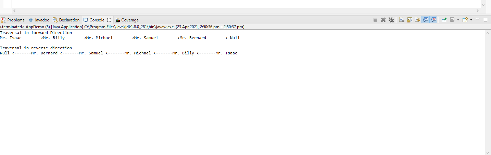

## DOUBLY LINKED LIST PROGRAM DOCUMENTATION

___

**This class uses generic datatype for implementation**

## Parent Class

~~~
    DoublyLinkedList 
~~~

~~~java
            T data;
	        Node prev;
	        Node next;
	        
	        
	        // Constructor to create a new node
	        // next and prev is by default initialized as null
	        
	        //Generic parameter for the inner node class
	        Node(T d) {
	        	
	        	data = d; 
	        	
	        	}
~~~

~~~
    insertAtFront(T new_data) 
~~~

**Where *T* is the generic data**

~~~java
            /* 1. allocate node 
	        * 2. put in the data */
	        Node new_Node = new Node(new_data);
	     
	        // 3. Make next of new node as head and previous as NULL */
	        new_Node.next = head;
	        new_Node.prev = null;
	     
	        // 4. change prev of head node to new node */
	        if (head != null)
	            head.prev = new_Node;
	     
	        // 5. move the head to point to the new node 
	        head = new_Node;
~~~

Other methods
* public void insertAtFront(T new_data) *Inserts data at the front of nodes*
* insertAfter(Node prev_node, int new_data) *This inserts a node a specified location*
* insertAtEnd(int new_data) *This inserts a node at the end*
* printList() *Prints the list | This method has forward and reverse traversal*

~~~java

	 Node last = null;
	        System.out.println("Traversal in forward Direction");
	        while (node != null) {
	            System.out.print(node.data + " ------->");
	            last = node;
	            node = node.next;
	        }
	        
	        System.out.println(" Null");
	        
	        System.out.println();
	        System.out.println("Traversal in reverse direction");
	        
	        System.out.print("Null");
	        System.out.print(" <-------");
	        while (last != null) {
	        	
	        	 if(last == head) {
		            	
	        		 System.out.print(last.data); 	
	        		 
		            }else {
		            	
	        	 	System.out.print(last.data + " <-------");
	            
		            }
	        	 
	            if(last == head) {
	            	
	            	
	            }
	            last = last.prev;
	        }
	        
	       
	    }
~~~

## Second Class for data structure application
___

~~~java
public class AppDemo
~~~

## Main method including assignement to implement family hierachy

~~~java

	/* Start with the empty list */
        DoublyLinkedList dll = new DoublyLinkedList();
 
        
       
 
        
        dll.insertAtFront("Mr. Isaac");
 
        
        dll.insertAfter(dll.head,"Mr. Billy");
 
        
        dll.insertAfter(dll.head.next, "Mr. Michael");
 
       
        dll.insertAfter(dll.head.next.next, "Mr. Samuel");
 
        
        dll.insertAtEnd("Mr. Bernard");
        
        
        
        dll.printlist(dll.head);

~~~

### Output

