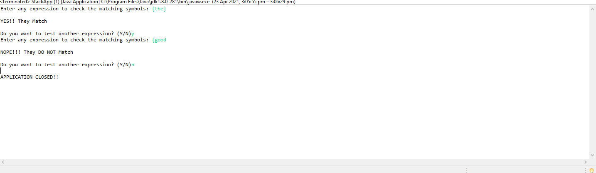

## STACK LIST PROGRAM DOCUMENTATION

___

**This class uses generic datatype for implementation**

## Interface

~~~java
    public interface Stack <E>
~~~

*Inside interface*
~~~java

    void push(E data);
	E pop();
	E top();
	boolean isEmpty();
	int size();
	void printStackData();
	void printStackDataStructure();
~~~

## Stack Implementation using linkedList

~~~java
public class LinkedListStack <E> implements Stack <E>
~~~

## Inner class
~~~java
class StackNode
~~~

**Methods**
* push(E data)
* pop()
* top()
* isEmpty()
* size()
* printStackData()
* printStackDataStructure()

## Stack Apllication class

~~~java
public class StackApp
~~~

## Method for apllication

~~~java

 public static boolean isMatched(String expression) {
    	final String opening = "({["; // opening delimiters
    	final String closing = ")}]"; // respective closing delimiters
    	
    	Stack<Character> buffer = new LinkedListStack<>();
    	
    	for (char c : expression.toCharArray( )) {
    		if (opening.indexOf(c) != -1 ) {	// this is a left delimiter
    			buffer.push(c);
    		}
    		else if (closing.indexOf(c) != -1 ) {	// this is a right delimiter
    			if (buffer.isEmpty( ))	// nothing to match with
    				return false;
    			if (closing.indexOf(c) != opening.indexOf(buffer.pop()))
    				return false;		// mismatched delimiter
    		}
    	}
    	
    	return buffer.isEmpty();	// were all opening delimiters matched?
    }
~~~

## Main method

~~~java   

Scanner keyboard = new Scanner(System.in);
		
		
		
		char key;
		do {
			
			System.out.print("Enter any expression to check the matching symbols: ");
			
			String exp = keyboard.next(); 
			System.out.println();
			boolean result = isMatched(exp);
			
			String reply;
			
		if(result == true) {
			System.out.println("YES!! They Match");
		}else {
			System.out.println("NOPE!!! They DO NOT Match");
		}
		System.out.println();
		System.out.print("Do you want to test another expression? (Y/N)");
		reply = keyboard.next();
		key = reply.charAt(0);
		}while(key == 'y' || key == 'Y');
		System.out.println();
		System.out.println("APPLICATION CLOSED!!");
	}
~~~

*Above method accepts data input to match a string*

## Output

