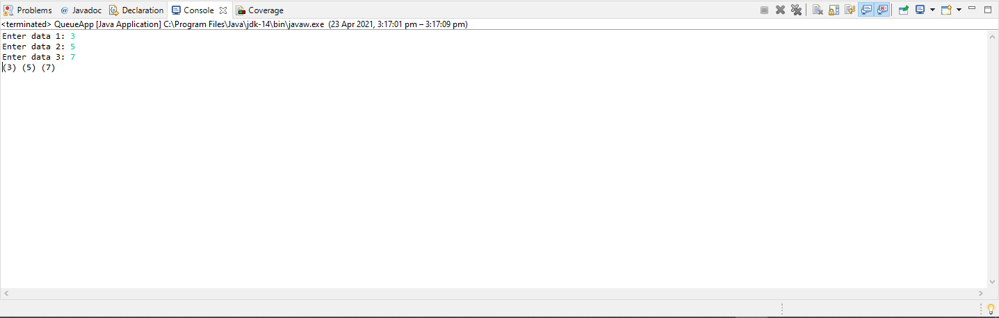

# STACK LIST PROGRAM DOCUMENTATION

___

**This class uses generic datatype for implementation**

## Parent class

~~~java
    // A linked list (LL) node to store a queue entry 
public class LinkedListQueue <T>{ 
    T data; 
    LinkedListQueue next; 
  
    // constructor to create a new linked list node 
    public LinkedListQueue(T data) 
    { 
        this.data = data; 
        this.next = null; 
    } 
} 
~~~

## Inner class

~~~java

class Queue <T>{ 
    LinkedListQueue front, rear; 
  
    public Queue() 
    { 
        this.front = this.rear = null; 
    } 
~~~

## Method for enqueue in the queue data structure

~~~java

// Method to add an key to the queue. 
    void enqueue(T data) 
    { 
  
        // Create a new LL node 
        LinkedListQueue temp = new LinkedListQueue(data); 
  
        // If queue is empty, then new node is front and rear both 
        if (this.rear == null) { 
            this.front = this.rear = temp; 
            return; 
        } 
  
        // Add the new node at the end of queue and change rear 
        this.rear.next = temp; 
        this.rear = temp; 
    } 
~~~

## Method for dequeue in the queue data structure

~~~java
// Method to remove an key from queue. 
    void dequeue() 
    { 
        // If queue is empty, return NULL. 
        if (this.front == null) 
            return; 
  
        // Store previous front and move front one node ahead 
        LinkedListQueue temp = this.front; 
        this.front = this.front.next; 
  
        // If front becomes NULL, then change rear also as NULL 
        if (this.front == null) 
            this.rear = null; 
    } 

~~~

## Other methods

~~~java

    // Displays all elements in the queue
    public void printQueue() {
    	
    	if(this.front == null) {	
    		System.out.println("Queue Empty!!");
    		return;
    	}
    	
    	while(this.front != null) {
    		System.out.print("("+this.front.data+ ") ");
    		this.front = this.front.next;
    	}
    }
    
    
    // Method to Check if there is no queue in the structure
    public boolean isEmpty() {
    	
    	if(this.front == null) {
    		return true;
    	}else {
    		return false;
    	}
    	
   }
    
    
    // Method to return the first element in the queue
    public T first() {
    	
    	T firstData = (T) this.front.data;
    	
    	return firstData;
    	
    }
    
    // Method return the size of the queue data structure
    public int size() {
    	
    	int i = 0;
    	
    	while(this.front != null) {
    		i = i+1;
    		this.front = this.front.next; 
    	}
    	
    	return i;
    	
    }
    

~~~

## QUEUE application 

~~~java

import java.util.Scanner;

public class QueueApp <T>{

	
//	public static  void printDocument() {
//		
//		Queue <String> q = new Queue<>();
//		Scanner keyboard = new Scanner(System.in);
//		int numOfPages;
//		
//		System.out.print("Enter number of pages for printing your document: ");
//		numOfPages = keyboard.nextInt();
//		
//		
//		
//		
//		
//		for(int i = 1 ; i <= numOfPages ; i++) {
//		
//			
//			System.out.println("Enter the content of line: "+i);	
//			String content = keyboard.next();
//			
//			
//			q.enqueue(content);
//			
//		}
//		
//			System.out.println("Number of lines: "+q.size());
//			
//			
//			q.printQueue();
			
//			System.out.print("Do you want to proceed to print document?(Y/N): ");
//			String reply = keyboard.next();
//			char ans = reply.charAt(0);
//			
//			if(ans == 'Y' || ans == 'y') {
//				System.out.println("*******************************************************************************");
//				q.printQueue();
//				System.out.println("*******************************************************************************");
//			}else {
//				
//				for(int i = 0; i <= q.size(); i++) {
//					q.dequeue();
//				}
//				
//				System.out.println("Printer closed!!");				
//			}
			
			
			
	

	public static void main(String[] args) {
		
		Queue q = new Queue();
		Scanner keyboard = new Scanner(System.in);
		
//		String [] names = new String[3];
//		
//		System.out.println("Enter "+names.length+" names");
		
//		for(int i = 0; i < names.length; i++) {
//			System.out.print("Enter name "+(i+1)+": ");
//			
//			names[i] = keyboard.next();
//			
//			keyboard.nextLine();
//		}
//
//	for (int i = 0; i < names.length; i++) {
//		
//		q.enqueue(names[i]);
//		
//		
//	}

//		q.printQueue();
		
		int num = 3;
		
		for(int i = 0; i < num; i++) {
			System.out.print("Enter data "+(i+1)+": ");
			String content = keyboard.next();
			q.enqueue(content);
			keyboard.nextLine();
			
		}
		
		q.printQueue();
	
	}
	
}

~~~

## Output
